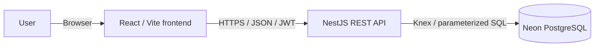
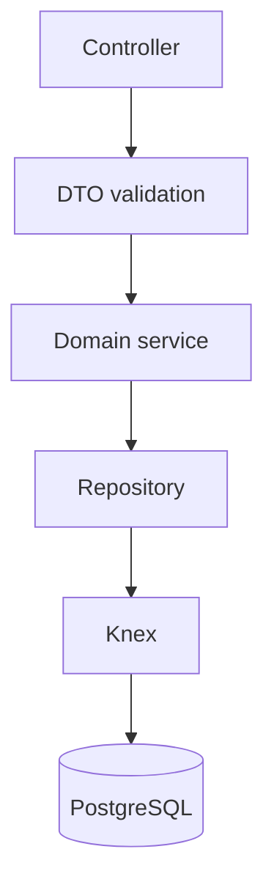
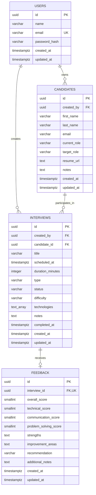
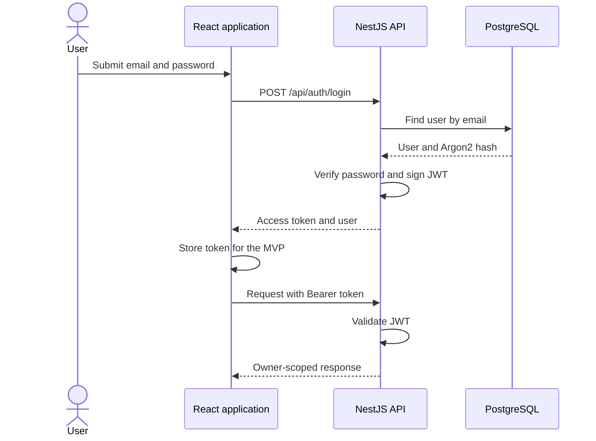
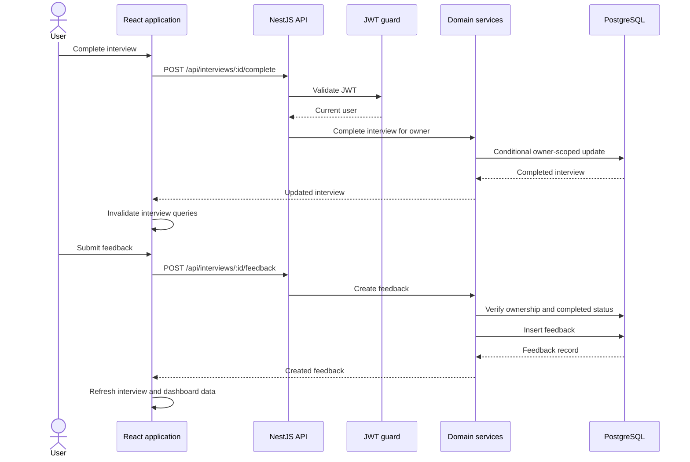
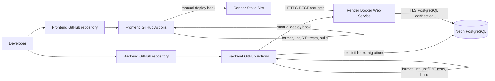

# InterviewLab Architecture

## Purpose

InterviewLab is a web application for preparing for and reviewing mock
technical interviews. An authenticated user manages candidates, schedules and
completes interview sessions, records structured feedback, and reviews
interview activity.

The solution uses two independently deployed repositories:

- `interview-lab-web`: React and Vite single-page application
- `interview-lab-api`: NestJS REST API and Knex database migrations

## System overview

The browser never connects directly to PostgreSQL. All access passes through
the API, which validates input, authenticates the user, enforces ownership, and
applies domain rules.

## Application structure

The backend is a modular monolith. Each domain has its own NestJS module while
sharing one process and database.

- Controllers define the REST endpoints.
- DTOs validate and transform untrusted request input.
- Services contain business rules and response mapping.
- Repositories own SQL access.
- Knex provides parameterized queries and versioned migrations.
- JWT guards protect private endpoints and provide the current user.

The frontend is organized by feature. React Router handles navigation, React
Hook Form handles form state, TanStack Query manages server state and cache
invalidation, Axios calls the API, and Material UI provides the desktop
component system.

## Data model

Important integrity rules:

- Every candidate and interview is owned by a user.
- Candidate email is unique per owner, not globally.
- Every interview belongs to exactly one candidate.
- An interview has at most one feedback record.
- Feedback is accepted only after an interview is completed.
- Score ranges and allowed status/type values are enforced in PostgreSQL.
- Candidate deletion is restricted when interview history exists.
- `TIMESTAMPTZ` stores absolute times; the frontend displays local time.

## Data flow

### Authentication

### Completing an interview and adding feedback

Authorization is enforced in database access patterns such as
`WHERE id = :id AND created_by = :currentUserId`. A UUID is not treated as an
authorization mechanism.

## Deployment approach

Deployment properties:

- Frontend and backend have independent build and deployment lifecycles.
- Render serves the compiled Vite frontend as static assets.
- Render builds and runs the API from its multi-stage Dockerfile.
- Neon provides managed PostgreSQL outside the API container.
- GitHub Actions validates changes before deployment.
- Production migrations are explicit deployment operations and do not run
  during application startup.
- Secrets are stored in GitHub and Render, not in either repository.
- CORS allows only configured frontend origins.

## Design decisions and tradeoffs

### Modular monolith

The current domain does not justify distributed services. A modular monolith
provides clear boundaries with lower deployment, testing, and operational
complexity. Modules could be extracted later if independent scaling or team
ownership required it.

### REST

The domain maps naturally to resources and a few domain actions, such as
completing an interview. REST keeps the contract easy to inspect through
OpenAPI. GraphQL would add complexity without solving a current requirement.

### PostgreSQL and Knex

The data is relational and benefits from foreign keys, unique constraints,
transactions, filtering, and aggregate queries. Knex keeps SQL visible while
providing composable queries and migration tooling. It requires more manual
mapping than a full ORM, which is accepted for greater SQL control.

### Two repositories

The frontend and API deploy independently and have different runtime concerns.
Separate repositories make those lifecycles explicit, at the cost of
coordinating API contract changes across repositories. OpenAPI-generated
clients would reduce that risk later.

### JWT storage

The MVP stores the JWT in `localStorage` for implementation simplicity. This
is vulnerable to token theft if an XSS issue exists. A production evolution
would use short-lived access tokens and secure HttpOnly cookies with CSRF
protection and refresh-token rotation.

### Search and reporting

Filtering and dashboard summaries use PostgreSQL and client-visible API data.
This is sufficient for the expected assignment dataset. PostgreSQL full-text
search, trigram indexes, dedicated report queries, and precomputed aggregates
would be introduced only when requirements or measurements justify them.

## Scalability and evolution

The API is stateless, so it can be replicated behind a load balancer.
PostgreSQL indexes support the primary owner, candidate, status, and date query
patterns. Likely future improvements are:

1. Query analysis and targeted indexes.
2. Database connection pooling and horizontal API scaling.
3. PostgreSQL full-text search before a dedicated search platform.
4. Materialized or asynchronously computed reporting aggregates.
5. Object storage and signed URLs for private candidate résumés.
6. Background jobs for slow or asynchronous work.

## Known limitations

- JWTs are stored in `localStorage`; refresh tokens are not implemented.
- Search does not yet cover all candidate, interview, technology, and feedback
  text.
- Reporting provides basic summaries but not score or activity trends.
- Résumé upload is designed but not implemented.
- The frontend intentionally targets desktop screens.
- Render's free API service can experience a cold start after inactivity.
- The application is an assignment MVP and has not been load-tested.
